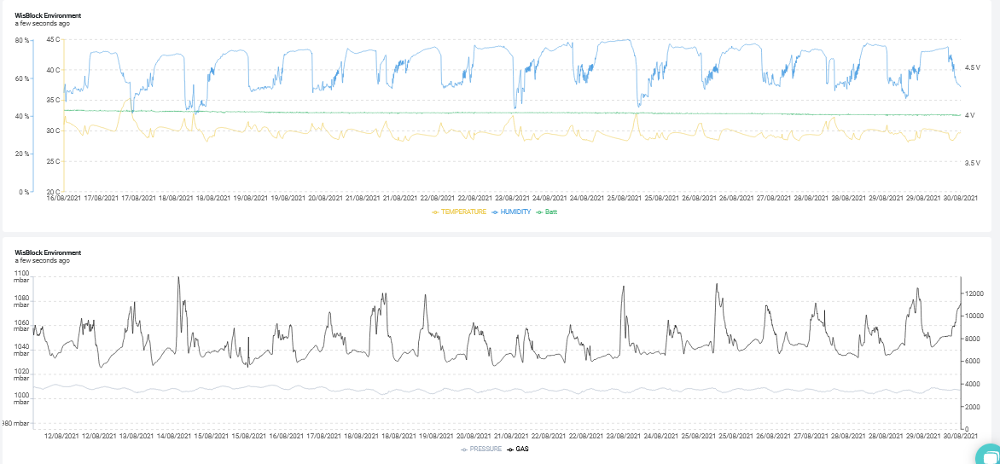

----
----
# _WORK IN PROGRESS_
----
----

# RAK4631-Kit-4-RAK1906
|  |  |    
| :-: | :-: |     
This is an example code for WisBlock Environment sensor ([WisBlock Kit 4](https://store.rakwireless.com/collections/kits-bundles/products/wisblock-kit-4-air-quality-monitor)) with RAK1906 environment sensor

It is based on my low power event driven example [RAK4631-Quick-Start-Examples](https://github.com/beegee-tokyo/RAK4631-Quick-Start-Examples)

----

# Hardware used
- [RAK4631](https://docs.rakwireless.com/Product-Categories/WisBlock/RAK4631/Overview/) WisBlock Core module
- [RAK5005-O](https://docs.rakwireless.com/Product-Categories/WisBlock/RAK5005-O/Overview/) WisBlock Base board
- [RAK1906](https://docs.rakwireless.com/Product-Categories/WisBlock/RAK1906/Overview/) WisBlock Sensor environment module

----

# Software used
- [PlatformIO](https://platformio.org/install)
- [Adafruit nRF52 BSP](https://docs.platformio.org/en/latest/boards/nordicnrf52/adafruit_feather_nrf52832.html)
- [Patch to use RAK4631 with PlatformIO](https://github.com/RAKWireless/WisBlock/blob/master/PlatformIO/RAK4630/README.md)
- [SX126x-Arduino LoRaWAN library](https://github.com/beegee-tokyo/SX126x-Arduino)
- [Adafruit BME680 Library](https://platformio.org/lib/show/1922/Adafruit%20BME680%20Library)
- [WisBlock-API](https://platformio.org/lib/show/12807/WisBlock-API)

## _REMARK_
The libraries are all listed in the **`platformio.ini`** and are automatically installed when the project is compiled.

----


# Setting up LoRaWAN credentials
The LoRaWAN settings can be defined in three different ways. 
- Over BLE with [My nRF52 Toolbox](https://play.google.com/store/apps/details?id=tk.giesecke.my_nrf52_tb)
- Over USB with [AT Commands](./AT-Commands.md)
- Hardcoded in the sources (_**ABSOLUTELY NOT RECOMMENDED**_)

## 1) Setup over BLE
Using the [My nRF52 Toolbox](https://play.google.com/store/apps/details?id=tk.giesecke.my_nrf52_tb) you can connect to the WisBlock over BLE and setup all LoRaWAN parameters like
- Region
- OTAA/ABP
- Confirmed/Unconfirmed message
- ...

More details can be found in the [My nRF52 Toolbox repo](https://github.com/beegee-tokyo/My-nRF52-Toolbox/blob/master/README.md)

The device is advertising over BLE only the first 30 seconds after power up and then again for 15 seconds after wakeup for measurements. The device is advertising as **`RAK-GNSS-xx`** where xx is the BLE MAC address of the device.

## 2) Setup over USB port
Using the AT command interface the WisBlock can be setup over the USB port.

A detailed manual for the AT commands are in [AT-Commands.md](./AT-Commands.md)

## 3) Hardcoded LoRaWAN settings
`void api_set_credentials(void);`
This informs the API that hard coded LoRaWAN credentials will be used. If credentials are sent over USB or from My nRF Toolbox, the received credentials will be ignored. _**It is strongly suggest NOT TO USE hard coded credentials to avoid duplicate node definitions**_    
If hard coded LoRaWAN credentials are used, they must be set before this function is called. Example:    
```c++
g_lorawan_settings.auto_join = false;							// Flag if node joins automatically after reboot
g_lorawan_settings.otaa_enabled = true;							// Flag for OTAA or ABP
memcpy(g_lorawan_settings.node_device_eui, node_device_eui, 8); // OTAA Device EUI MSB
memcpy(g_lorawan_settings.node_app_eui, node_app_eui, 8);		// OTAA Application EUI MSB
memcpy(g_lorawan_settings.node_app_key, node_app_key, 16);		// OTAA Application Key MSB
memcpy(g_lorawan_settings.node_nws_key, node_nws_key, 16);		// ABP Network Session Key MSB
memcpy(g_lorawan_settings.node_apps_key, node_apps_key, 16);	// ABP Application Session key MSB
g_lorawan_settings.node_dev_addr = 0x26021FB4;					// ABP Device Address MSB
g_lorawan_settings.send_repeat_time = 120000;					// Send repeat time in milliseconds: 2 * 60 * 1000 => 2 minutes
g_lorawan_settings.adr_enabled = false;							// Flag for ADR on or off
g_lorawan_settings.public_network = true;						// Flag for public or private network
g_lorawan_settings.duty_cycle_enabled = false;					// Flag to enable duty cycle (validity depends on Region)
g_lorawan_settings.join_trials = 5;								// Number of join retries
g_lorawan_settings.tx_power = 0;								// TX power 0 .. 15 (validity depends on Region)
g_lorawan_settings.data_rate = 3;								// Data rate 0 .. 15 (validity depends on Region)
g_lorawan_settings.lora_class = 0;								// LoRaWAN class 0: A, 2: C, 1: B is not supported
g_lorawan_settings.subband_channels = 1;						// Subband channel selection 1 .. 9
g_lorawan_settings.app_port = 2;								// Data port to send data
g_lorawan_settings.confirmed_msg_enabled = LMH_UNCONFIRMED_MSG; // Flag to enable confirmed messages
g_lorawan_settings.resetRequest = true;							// Command from BLE to reset device
g_lorawan_settings.lora_region = LORAMAC_REGION_AS923_3;		// LoRa region
// Inform API about hard coded LoRaWAN settings
api_set_credentials();
```

_**REMARK!**_    
Hard coded credentials must be set in `void setup_app(void)`!

----

# Debug options 
Debug output can be controlled by defines in the **`platformio.ini`**    
_**LIB_DEBUG**_ controls debug output of the SX126x-Arduino LoRaWAN library
 - 0 -> No debug outpuy
 - 1 -> Library debug output (not recommended, can have influence on timing)    

_**MY_DEBUG**_ controls debug output of the application itself
 - 0 -> No debug outpuy
 - 1 -> Application debug output

_**CFG_DEBUG**_ controls the debug output of the nRF52 BSP. It is recommended to keep it off

## Example for no debug output and maximum power savings:

```ini
[env:wiscore_rak4631]
platform = nordicnrf52
board = wiscore_rak4631
framework = arduino
build_flags = 
    ; -DCFG_DEBUG=2
	-DSW_VERSION_1=1 ; major version increase on API change / not backwards compatible
	-DSW_VERSION_2=0 ; minor version increase on API change / backward compatible
	-DSW_VERSION_3=0 ; patch version increase on bugfix, no affect on API
	-DLIB_DEBUG=0    ; 0 Disable LoRaWAN debug output
	-DMY_DEBUG=0     ; 0 Disable application debug output
	-DNO_BLE_LED=1   ; 1 Disable blue LED as BLE notificator
lib_deps = 
	beegee-tokyo/SX126x-Arduino
	adafruit/Adafruit BME680 Library
	https://github.com/beegee-tokyo/WisBlock-API
extra_scripts = pre:rename.py
```

----

# Payload decoder for Chirpstack and TTN    

The payload is encoded in the same format as the RAKwireless WisNode devices.
A payload decoder for Chirpstack and TTN can be found in the [RAKwireless Payload Decoder](https://github.com/RAKWireless/RUI_LoRa_node_payload_decoder) Github repo.

# Visualization on DataCake

[Real time data](https://app.datacake.de/dashboard/d/b6acccc0-2264-42d4-aec9-94148d7eb76f)




